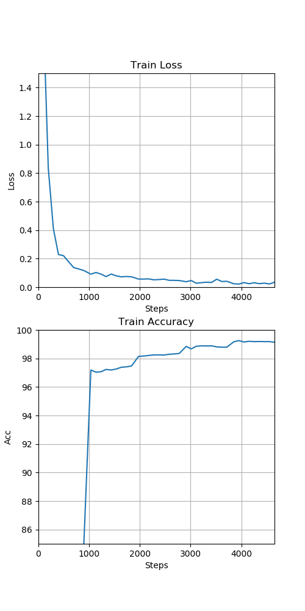
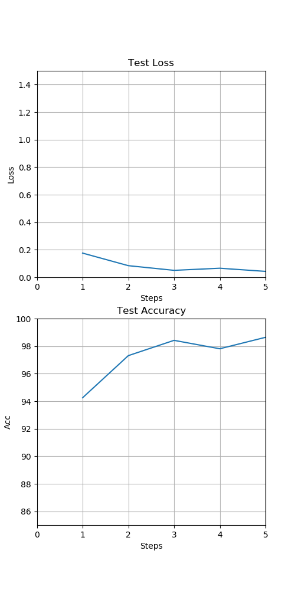

### Hyperparams
- Torch.seed = 0
- Epochs = 5
- Batch_size = 64
- Learning Rate = 0.01
- Best Train Accuracy:
    - Step = 3952.0
    - Train Accuracy = 99.2500
    - Train loss = 0.022074
- Best Test Accuracy:
    - Step = 5.0
    - Train Accuracy = 98.6400
    - Train loss = 0.042932
    
- Training time = 170.86s ≈ 2 min

